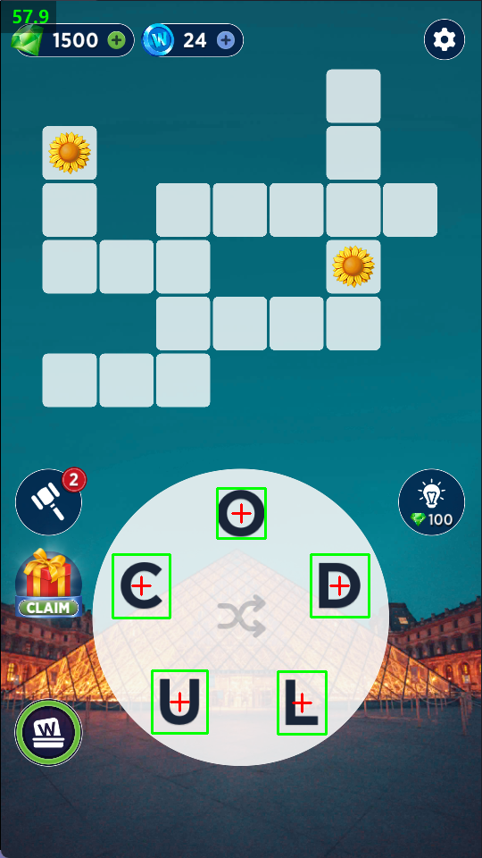

# Words of Wonders: Fugo Games
Automate game using `Python`

## How it works.
1. `Capture the Game Screen`: I used PyAutoGUI to take screenshots of the game board.

1. `OCR Letter Recognition`: With EasyOCR, I extracted the letters from the game wheel to figure out the available ones.

1. `Word Prediction`: I utilized a huge dictionary of over 400k words (found on GitHub as words.txt) to predict the possible valid words that could be formed from the letters.
2. `Automating Gameplay`: The system then uses PyAutoGUI to drag and drop the letters onto the game board to form the words and advance in the game.

## Demo

